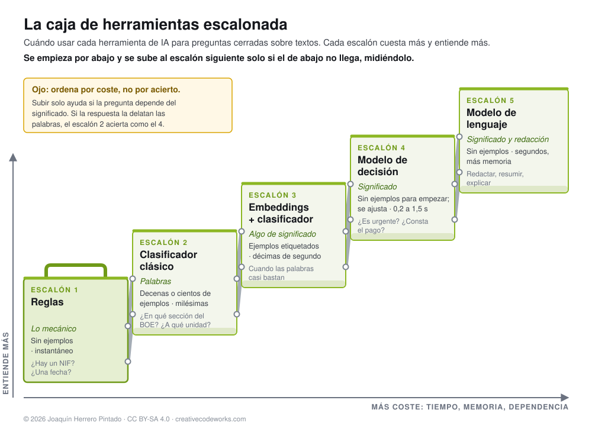

# Toolkit de evaluación de modelos de decisión

Un **modelo de decisión** es un modelo de inteligencia artificial que no escribe. Recibe un texto, una pregunta cerrada y
una lista de respuestas posibles, y devuelve **una probabilidad para cada respuesta**. Si lo escribieras como una función:

```python
def decidir(texto: str, pregunta: str, opciones: list[str]) -> dict[str, float]: ...
```

Un ejemplo real, con Kev-4B ejecutándose en un ordenador de sobremesa:

> **Texto:** «El interesado presentó la solicitud el 15 de enero, pero no consta el pago de la tasa.»
> **Pregunta:** ¿Está la solicitud completa?
> **Respuesta:** sí 0,7 % · no 94,9 % · no consta 4,4 %

No puede inventar una respuesta fuera de la lista, devuelve datos en lugar de texto y dice cuánta seguridad tiene. Por
eso sirve para clasificar, encaminar y comprobar documentos: el trabajo que hoy se hace a mano en un registro de entrada
o en una cola de expedientes.

**A quién va dirigido.** A programadores que ya han usado modelos de lenguaje (han llamado a la API de un chat, han
escrito *prompts*) y se acercan por primera vez a los modelos de decisión y al ajuste fino (*fine-tuning*). No hace falta
saber aprendizaje automático: el informe explica desde cero lo que hace falta (*logits*, softmax, log-loss, calibración,
LoRA, cómo repartir los datos) con ejemplos de código y con un caso real medido. Los ejemplos son de administración
pública, pero las ideas valen para cualquier clasificación de textos.

Este repositorio es un **toolkit de evaluación de modelos de decisión**: las mismas pruebas se repetirán con cada modelo
nuevo que salga, para seguir el estado de esta tecnología. Reúne:

| Carpeta | Qué contiene |
|---|---|
| [`informe/`](informe/) | Un informe introductorio: qué son, en qué se diferencian de un chat, cómo se llaman desde código, cómo funcionan por dentro, cómo se ajustan con casos propios y qué hay que medir ([PDF](informe/modelos-de-decision.pdf)) |
| [`laboratorio/`](laboratorio/) | Una web local para comparar varios modelos de decisión con los mismos casos |
| [`boe/`](boe/) | Una prueba con textos reales del BOE: construir los datos, evaluar, ajustar un modelo y medirlo |
| [`pawsx/`](pawsx/) | Una prueba de significado con PAWS-X en español: pares de frases que parecen iguales y no lo son |
| [`casos/`](casos/) | Tres casos de uso con nota de 1 a 10: triaje de correo, completitud de expedientes y respuestas apoyadas en un documento ([diseño, fijado antes de medir](casos/DISENO.md)) |
| [`embeddings.py`](embeddings.py) | La referencia con *embeddings* (bge-m3) y clasificador, para todas las pruebas |
| [`resultados/`](resultados/) y [`docs/`](docs/) | Los resultados (sin textos), la página que los muestra y la de [metodología](https://joakinen.github.io/toolkit-modelos-de-decision/metodologia.html) |

**Ver los resultados sin instalar nada:** <https://joakinen.github.io/toolkit-modelos-de-decision/>

## Resultados principales



Para responder una pregunta cerrada sobre un texto hay cinco herramientas, de la más barata a la más cara: reglas, un
clasificador clásico (TF-IDF y regresión logística), *embeddings* con clasificador, un modelo de decisión y un modelo de
lenguaje general: los escalones de una **caja de herramientas escalonada**. **Se empieza por abajo y se sube al escalón
siguiente solo cuando el de abajo no llega, midiéndolo.** Las pruebas
del toolkit, todas en español, dicen hasta dónde hizo falta subir:

| Pregunta | Depende de | Resultado |
|---|---|---|
| ¿En qué apartado del BOE se publica este texto? | Vocabulario | Un clasificador clásico entrenado en 9 segundos (95 %) iguala a Kev-4B ajustado durante 11 horas (96 %; la diferencia no se distingue del azar), y con solo 5 ejemplos por apartado supera a todos los modelos sin ajustar |
| ¿Significan lo mismo estas dos frases? (PAWS-X) | Significado | El clásico se queda en el azar incluso con 5.000 ejemplos; Kev-4B, sin haber visto la tarea, llega al 78 %, y Kev-0.8B ajustado con 200 pares pasa del 60 % al 80 % |
| Triaje del buzón general | Las dos cosas | El clásico es el mejor encaminando a la unidad (8,6 sobre 10), pero no distingue lo urgente (2,2); Kev-4B saca un 7,5 en conjunto |
| ¿Está completo este expediente? | Significado | Kev-4B saca un 8,4; el clásico, un 3,3 |

Un modelo de chat general de 9.000 millones de parámetros, preguntado para que conteste con una letra, rinde como Kev-4B
en los casos de uso, pero tarda de tres a cuatro veces más. Casi todos los modelos se equivocan con demasiada seguridad:
no se les deben fijar umbrales sin recalibrarlos. El detalle está en el [informe](informe/modelos-de-decision.pdf), la
[página de resultados](https://joakinen.github.io/toolkit-modelos-de-decision/) y la
[metodología](https://joakinen.github.io/toolkit-modelos-de-decision/metodologia.html).

## Veredicto provisional (29 de septiembre de 2026)

Con los modelos probados hasta ahora (Kev-0.8B y Kev-4B, sin ajustar y ajustados; Jeff-0.8B y Jeff-2B; las réplicas
abiertas de Jev de 800 y 2.000 millones; Qwen3.5 9B como modelo de chat general; y dos referencias sin modelo de
lenguaje): para preguntas que dependen del **significado**, los modelos de decisión abiertos de 2.000 a 4.000 millones
de parámetros **ya son útiles con revisión humana**, en una máquina propia; para preguntas que se resuelven por el
**vocabulario**, **un clasificador clásico basta** y es mucho más barato. Ninguno está para decidir solo. Su punto más
débil sigue siendo la madurez: son proyectos de semanas, con herramientas que tienen límites que no avisan. La valoración
completa está al final del [informe](informe/modelos-de-decision.pdf); se revisará con cada modelo nuevo y cada versión
queda anotada en [CAMBIOS.md](CAMBIOS.md).

## Cuánto cuesta el ajuste

Ajustar un modelo (el *post-training*) es seguir entrenándolo con casos propios. Esto es lo que costó en la prueba del
BOE, medido por el propio entrenador de Kev en un Mac mini con M4 Pro y 24 GB de memoria, sin servicios externos:

| | Kev-0.8B | Kev-4B |
|---|---|---|
| Tiempo de ajuste | **3 h 29 min** | **11 h 35 min** |
| Ejemplos propios | 1.400 (200 por apartado), más 160 generales de repaso | Los mismos |
| Pasadas por los datos | 3 (4.680 ejemplos procesados, 2,1 millones de tokens) | Las mismas |
| Segundos por ejemplo | 2,68 | 8,91 |
| Memoria máxima de GPU | 3,3 GB | 9,2 GB |
| Qué se entrena | Una LoRA de rango 16: en torno al 1 % de los parámetros | Lo mismo, con la base en media precisión |

Antes hay que reunir los datos: descargar los 1.400 textos tardó unos 27 minutos, a una petición por segundo. Evaluar
los 350 textos de prueba lleva alrededor de un minuto con el 0.8B. El tiempo de ajuste crece en proporción a los ejemplos
y a las pasadas, y con el tamaño del modelo: el 4B va unas 3,3 veces más lento por ejemplo que el 0.8B. Con el 4B, 24 GB
son el límite: el equipo llegó a usar unos 14 GB de intercambio a disco.

## Probar el laboratorio

El laboratorio es una web que hace de intermediaria entre tú y varios modelos que se ejecutan en tu máquina. Trae 12
casos de prueba (seis fáciles y seis con trampa), triajes de ejemplo y un formulario para hacer tus propias preguntas.

```sh
git clone https://github.com/joakinen/toolkit-modelos-de-decision && cd toolkit-modelos-de-decision
uv sync
cd laboratorio && uv run uvicorn app:app --host 127.0.0.1 --port 8090
```

Abre <http://127.0.0.1:8090>. Verás los resultados de referencia; para usar los modelos, arranca los que quieras (los
que no estén en marcha aparecen como parados y el resto funciona igual):

| Modelo | Cómo arrancarlo |
|---|---|
| Kev-0.8B y Kev-4B | En una copia de [Kev](https://github.com/jaredpalmer/kev) (probado en el commit `3d9973b`): `uv sync --extra serve` y después `uv run python -m kev.serve --run jaredpalmer/kev-0.8b --port 8008` (y `kev-4b` en el 8009) |
| Jeff-0.8B y Jeff-2B | En una copia de [Jeff](https://github.com/firelex/jeff) (probado en el commit `2c1bfce`; pide uv 0.12.19 o posterior): `uv sync --extra mac`, descargar `mstrasser/Jeff-Qwen3.5-0.8B` (y `-2B`) con `hf download` y `JEFF_BACKEND=mlx JEFF_CHECKPOINT=<carpeta> PORT=8010 uv run jeff-serve` (el 2B en el 8011) |
| Jev-style v1 · 2B | Con [Ollama](https://ollama.com): `ollama pull hf.co/chaoliangUNSW/Jev-Style-Qwen3.5-2B-Decision-GGUF:Q8_0` |
| Qwen3.5 · 9B | Con Ollama: `ollama pull qwen3.5:9b` |
| Jev-style v3 · 0.8B | Necesita compilar `jev-score` contra llama.cpp ([ficha del modelo](https://huggingface.co/chaoliangUNSW/Jev-Style-0.8B-Decision-v3-GGUF)), indicar su carpeta en `JEV_V3_DIR` e instalar el extra: `uv sync --extra jev-v3` |

Los puertos y direcciones se cambian con variables de entorno; están al principio de [`laboratorio/app.py`](laboratorio/app.py).
El laboratorio escucha solo en tu máquina.

## Repetir la prueba del BOE

Los textos no se publican aquí, porque algunos contienen nombres de personas. Se descargan de la API de datos abiertos
del BOE con [`boe/construir.py`](boe/construir.py), a una petición por segundo y con caché:

```sh
uv sync --extra boe                        # añade pyarrow, para los controles y la calibración
cd boe
uv run python construir.py sumarios        # sumarios de enero a septiembre de 2026
uv run python construir.py prueba          # 350 textos de julio y agosto  -> prueba.jsonl
uv run python construir.py entrenamiento   # 1.400 textos de enero a junio -> entrenamiento.jsonl
uv run python construir.py calibracion     # 140 textos de septiembre      -> calibracion.jsonl
uv run python control.py                   # 12 preguntas ajenas al BOE, para ver si el ajuste hace olvidar
KEV_DIR=/ruta/a/kev uv run python control_ampliado.py   # esas 12 más 440 del test de Kev (en inglés)
uv run python control_es.py                # 150 preguntas en español (XNLI, PAWS-X, reseñas de Amazon)
KEV_DIR=/ruta/a/kev uv run python calibracion.py        # 400 casos apartados para recalibrar
uv run python evaluar.py                   # los modelos del laboratorio, sin ajustar
KEV_DIR=/ruta/a/kev sh ajustar.sh          # ajusta, evalúa y calcula la temperatura (horas; ver el script)
uv run python exportar.py && uv run python pagina.py   # resultados/boe.json y docs/index.html
```

`ajustar.sh` no escribe la temperatura en el modelo: `calibrar.py` la calcula, dice si basta una sola y da el comando
de Kev para escribirla. En la prueba publicada se escribió en el 4B y no en el 0.8B.

Las reglas de cada conjunto (periodos, recorte a 2.000 caracteres, un máximo de tres textos casi idénticos, sin título,
tamaños y semillas de los controles y de la calibración) están explicadas al principio de cada script y se fijaron antes
de medir ningún modelo. Los controles se descargan de sus fuentes y no se publican aquí: cada colección tiene su licencia
(XNLI, por ejemplo, no permite el uso comercial).

## Repetir PAWS-X y los casos de uso

```sh
PAWSX_DATOS=<carpeta> uv run python pawsx/construir.py   # descarga PAWS-X y fija prueba y bolsa de entrenamiento
PAWSX_DATOS=<carpeta> uv run python pawsx/clasico.py     # el clasificador clásico con 50 a 5.000 pares
uv run python casos/construir.py correo                  # correos sintéticos (publicados) -> peticiones
uv run python casos/construir.py expedientes
BOE_DATOS=<carpeta del BOE> uv run python casos/apoyo/construir.py   # necesita Ollama con gemma4:12b
uv run python casos/evaluar.py correo                    # todos los modelos del laboratorio y el clásico
uv run python embeddings.py correo                       # la referencia con embeddings (Ollama con bge-m3)
uv run python casos/notas.py correo expedientes apoyo    # la nota de 1 a 10
uv run python casos/exportar.py && uv run python boe/pagina.py
```

Los correos y expedientes sintéticos se publican (CC BY-SA 4.0). El caso de respuestas apoyadas se construye con textos
del BOE y no se publica. La prueba privada con correos reales se explica en
[`casos/correo/privado/LEEME.md`](casos/correo/privado/LEEME.md). Mide un grupo de modelos cada vez: con todos cargados a
la vez, un equipo de 24 GB se queda sin memoria ([`casos/medir_por_fases.sh`](casos/medir_por_fases.sh) lo hace así).

## Cuidados

- **Datos personales.** Los textos del BOE son públicos, pero su reutilización debe respetar la protección de datos. No
  publiques el conjunto descargado ni un modelo ajustado con él.
- **Condiciones del BOE.** La reutilización está permitida citando la fuente, sin alterar el sentido de la información y
  sin sugerir que el BOE respalda el uso. Consulta el [aviso legal](https://www.boe.es/informacion/aviso_legal/index.php).
- **Decisiones con efectos sobre personas.** Estos modelos sirven como apoyo a la tramitación. El artículo 22 del RGPD y
  el artículo 41 de la Ley 40/2015 limitan las decisiones puramente automatizadas; el informe lo explica.
- **Unas pocas pruebas no son una evaluación general.** Los resultados valen para estas preguntas, estos datos (en parte
  sintéticos) y estos modelos. Mídelos siempre con tus propios casos, y siempre contra un clasificador clásico.

## Créditos y licencias

- Código: [Apache-2.0](LICENSE). Informe, documentación, página de resultados y resultados:
  [CC BY-SA 4.0](https://creativecommons.org/licenses/by-sa/4.0/deed.es) (puedes copiarlos y adaptarlos citando la
  fuente, y lo que publiques a partir de ellos debe llevar la misma licencia).
- Datos: Agencia Estatal Boletín Oficial del Estado ([boe.es](https://www.boe.es)), datos abiertos. Controles: el
  conjunto de prueba de Kev (`evals/v7/decision-v7`), [XNLI](https://huggingface.co/datasets/facebook/xnli),
  [PAWS-X](https://huggingface.co/datasets/google-research-datasets/paws-x) y
  [reseñas de Amazon en español](https://huggingface.co/datasets/SetFit/amazon_reviews_multi_es), cada uno con su licencia.
- Modelos: [Kev](https://github.com/jaredpalmer/kev) de Jared Palmer; [Jeff](https://github.com/firelex/jeff) de firelex;
  Jev-style de [chaoliangUNSW](https://huggingface.co/chaoliangUNSW); Qwen3.5 de Alibaba; bge-m3 de BAAI (*embeddings*);
  Gemma 4 de Google (redactó las respuestas del caso de respuestas apoyadas). La idea de convertir un modelo de chat en uno de decisión leyendo la probabilidad de cada letra
  viene de [este artículo de allanrbo](https://allanrbo.blogspot.com/2026/09/a-jev-like-wrapper-for-llms-including.html).
- Jev es un modelo cerrado de TypeSafe AI; este repositorio no está afiliado a TypeSafe.

Joaquín Herrero Pintado · Creative Codeworks ([creativecodeworks.com](https://creativecodeworks.com)). Hecho con la asistencia de
Claude Code (Anthropic); el detalle está en los créditos del [informe](informe/modelos-de-decision.pdf).
